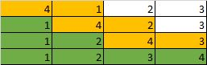

# 📌 Bubble Sort

## 🔍 Konsep

🧼 **Bubble sort** adalah algoritma pengurutan sederhana yang bekerja dengan **membandingkan pasangan elemen bersebelahan** dalam daftar dan **menukarnya jika urutannya salah**. Proses ini berulang terus hingga tidak ada lagi pertukaran yang perlu dilakukan.

🔁 Elemen akan "menggelembung" ke tempat yang benar — seperti **gelembung air** yang naik ke permukaan.

⚠️ Meski mudah dipahami, algoritma ini **kurang efisien untuk data besar** karena kompleksitas waktunya tinggi.

📸 
🔗 [Lihat ilustrasi animasi](https://visualgo.net/en/sorting)

---

### ✅ Kelebihan

- 🧠 **Implementasi sangat mudah** dan cocok untuk pemula
- ✨ Cocok untuk data yang **sudah hampir terurut**

---

### ❌ Kekurangan

- 🐢 **Kompleksitas waktu buruk** → $O(n^2)$
- 📦 **Tidak efisien dalam penggunaan memori**
- 🔄 **Tidak stabil** untuk elemen yang sama (posisi bisa berubah)

---

## 🧪 Contoh Penerapan

Contoh implementasi **Bubble Sort** dalam Java:

```java
public class Main {
    static void bubbleSort(int[] arr) {
        int n = arr.length;
        for (int i = 0; i < n - 1; i++) {
            for (int j = 0; j < n - 1 - i; j++) {
                if (arr[j] > arr[j + 1]) {
                    int temp = arr[j];
                    arr[j] = arr[j + 1];
                    arr[j + 1] = temp;
                }
            }
        }
    }

    public static void main(String[] args) {
        int[] array = {4, 2, 3, 1};
        bubbleSort(array);
        System.out.print("Sorted array: ");
        for (int i = 0; i < array.length; i++) {
            System.out.print(array[i] + " ");
        }
        System.out.println();
    }
}
```

🧾 **Input**: `{4, 2, 3, 1}`
📤 **Output**: `1 2 3 4`

---

## 🧠 Tambahan

🔎 Coba mainkan animasinya di sini:
👉 [Visualisasi Bubble Sort](https://www.hackerearth.com/practice/algorithms/sorting/bubble-sort/visualize/)

---
