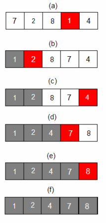

# 📌 Selection Sort

## 🔍 Konsep

🔽 **Selection sort** adalah algoritma pengurutan sederhana yang bekerja dengan **memilih elemen terkecil** dari daftar dan **menukarnya dengan elemen pertama**.

🔁 Proses ini terus dilakukan dengan **memilih elemen terkecil berikutnya** dari sisa daftar yang belum terurut dan **menempatkannya ke posisi yang sesuai**.

📌 Nama "selection" diambil karena algoritma ini **selalu menyeleksi elemen terkecil** pada setiap iterasi.

📸 
🔗 [Lihat ilustrasi animasi](https://visualgo.net/en/sorting)

---

### ✅ Kelebihan

- 🧠 **Sederhana dan mudah dipahami**
- 🧩 Bisa menjaga urutan relatif dari elemen yang sama _(jika diimplementasikan dengan benar)_

---

### ❌ Kekurangan

- 🐢 **Kompleksitas waktu tinggi** → $O(n^2)$
- 🔄 **Tidak efisien** untuk data yang hampir terurut
- 📦 **Penggunaan memori tidak optimal**

---

## 🧪 Contoh Penerapan (Java)

```java
public class Main {
    static void selectionSort(int[] arr) {
        int n = arr.length;
        for (int i = 0; i < n - 1; i++) {
            int minIndex = i;
            for (int j = i + 1; j < n; j++) {
                if (arr[j] < arr[minIndex]) {
                    minIndex = j;
                }
            }
            if (minIndex != i) {
                int temp = arr[i];
                arr[i] = arr[minIndex];
                arr[minIndex] = temp;
            }
        }
    }

    public static void main(String[] args) {
        int[] array = {7, 2, 8, 1, 4};
        selectionSort(array);

        System.out.print("Sorted array: ");
        for (int i = 0; i < array.length; i++) {
            System.out.print(array[i] + " ");
        }
        System.out.println();
    }
}
```

📥 **Input**: `{7, 2, 8, 1, 4}`
📤 **Output**: `1 2 4 7 8`

---

## 🧠 Tambahan

🔎 Visualisasi interaktif bisa kamu cek di:
👉 [Visualisasi Selection Sort](https://www.hackerearth.com/practice/algorithms/sorting/selection-sort/visualize/)
