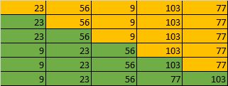

# 📌 Insertion Sort

## 🔍 Konsep

📥 **Insertion Sort** bekerja dengan **membagi array menjadi dua bagian**:
✅ bagian yang sudah terurut
🔧 dan bagian yang belum terurut.

➡️ Setiap elemen dari bagian belum terurut akan **"disisipkan" ke posisi yang tepat** di bagian terurut.

✨ Algoritma ini cukup efisien untuk data yang **hampir terurut** dan lebih baik daripada bubble sort di beberapa kasus.

📸 
🔗 [Lihat ilustrasi animasi](https://visualgo.net/en/sorting)

---

### ✅ Kelebihan

- 🧠 **Sederhana dan mudah dipahami**
- ⚡ **Efisien** untuk data yang hampir terurut
- 🔄 **Stabil** – menjaga urutan elemen yang sama

---

### ❌ Kekurangan

- 🐢 Kompleksitas waktu tinggi → $O(n^2)$
- 🔁 Tidak efisien untuk data dalam urutan terbalik
- 📦 Penggunaan memori yang tidak optimal

---

## 🧪 Contoh Penerapan (Java)

```java
public class Main {
    static void insertionSort(int[] arr) {
        int n = arr.length;
        for (int i = 1; i < n; i++) {
            int key = arr[i];
            int j = i - 1;

            while (j >= 0 && arr[j] > key) {
                arr[j + 1] = arr[j];
                j--;
            }

            arr[j + 1] = key;
        }
    }

    public static void main(String[] args) {
        int[] array = {23, 56, 9, 103, 77};
        insertionSort(array);

        System.out.print("Sorted array: ");
        for (int i = 0; i < array.length; i++) {
            System.out.print(array[i] + " ");
        }
        System.out.println();
    }
}
```

📥 **Input**: `{23, 56, 9, 103, 77}`
📤 **Output**: `9 23 56 77 103`

---

## 🧠 Tambahan

🎥 Coba langsung dan lihat visualisasinya di:
👉 [Visualisasi Insertion Sort](https://www.hackerearth.com/practice/algorithms/sorting/insertion-sort/visualize/)

---
